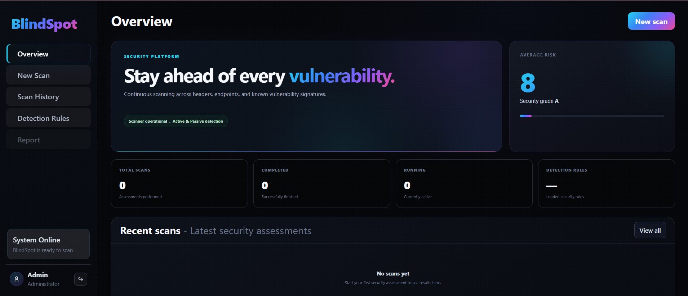
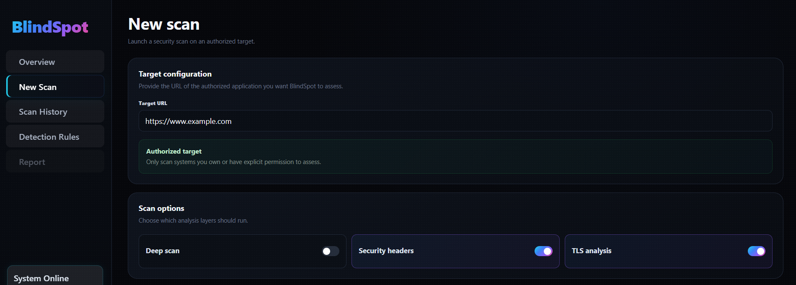
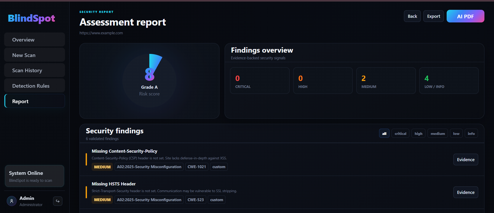

# BlindSpot — Website Vulnerability Scanner

BlindSpot is a full-stack web security scanning platform that maps attack surfaces, detects real vulnerabilities through passive analysis and active probing, and delivers evidence-backed security reports with clear remediation guidance — all from a single, easy-to-use dashboard.

**Team ID:** 48
**Team Name:** Cyberdefeders
**Hackathon:** GLS Nexus Hackathon 2026

---

## Table of Contents

* [Overview](#overview)
* [Key Features](#key-features)
* [Tech Stack](#tech-stack)
* [Architecture](#architecture)
* [Screenshots](#screenshots)
* [Setup Instructions](#setup-instructions)
* [Usage](#usage)
* [Live Demo](#live-demo)
* [Project Documentation](#project-documentation)
* [Team](#team)
* [Responsible Use](#responsible-use)

---

## Overview

BlindSpot is a security assessment platform built to give developers, students, and security enthusiasts an accessible way to assess web applications for common security weaknesses.

It combines **passive security analysis** with **non-destructive active probing** to provide a realistic, evidence-backed view of a target application's security posture.

### Passive Analysis

BlindSpot analyzes a target for issues such as:

* Missing or misconfigured security headers
* HTTPS and TLS configuration issues
* Outdated JavaScript libraries and technologies
* Exposed sensitive files and resources
* Technology fingerprints
* Other rule-based security indicators

### Active Probing

BlindSpot can perform controlled, non-destructive probes for:

* Reflected Cross-Site Scripting (XSS)
* Error-Based SQL Injection
* Time-Based Blind SQL Injection
* CRLF / HTTP Header Injection
* Local File Inclusion (LFI) / Path Traversal
* Open Redirect

Every active finding is designed to provide supporting evidence rather than relying solely on heuristic guesses.

### Evidence-Backed Findings

Each finding can include:

* The request or probe that was sent
* Relevant response information
* The signal that confirmed the finding
* Severity and risk information
* OWASP categorization
* Recommended remediation

This makes BlindSpot's results more transparent, explainable, and easier to verify.

---

## Key Features

### Passive Security Scanning

Detects common web security weaknesses including:

* Missing Content Security Policy (CSP)
* Missing HTTP Strict Transport Security (HSTS)
* Missing X-Frame-Options
* Other security-header issues
* TLS/HTTPS configuration weaknesses
* Outdated JavaScript libraries
* Exposed files and resources such as `.git` and `robots.txt`
* Technology fingerprinting

### Active Vulnerability Probing

Controlled probes for:

* Reflected XSS
* Error-Based SQL Injection
* Time-Based Blind SQL Injection
* CRLF / HTTP Header Injection
* Local File Inclusion / Path Traversal
* Open Redirect

### Configurable Scan Intensity

Choose the depth of the assessment:

* **Passive** — passive security analysis only
* **Light Active** — passive analysis plus selected active probes
* **Full Active** — comprehensive passive and active assessment

### OWASP Top 10 Mapping

Security findings are mapped to relevant **OWASP Top 10** categories to provide clearer security context and help prioritize remediation.

### Risk Scoring Engine

BlindSpot calculates an overall risk score from **0–100** and assigns a corresponding **A–F security grade** based on detected findings, severity, and coverage.

### Evidence-Backed Reporting

Security findings include supporting request/response information, detection signals, severity details, and remediation guidance.

### Detection Rules Engine

BlindSpot uses a searchable security-rule library built from:

* CVE-based detection data
* Wappalyzer technology detection data
* Nuclei-derived detection rules

These rules power automated passive detection and technology/security analysis.

### AI-Assisted PDF Reports

Generate professional security assessment reports from scan results, including:

* Executive-level security summary
* Risk score and grade
* Vulnerability findings
* Severity breakdown
* Evidence
* OWASP mapping
* Remediation guidance

### JSON Export

Export complete raw scan data in JSON format for further analysis, automation, or integration.

### Authenticated Scanning

Supports custom authentication cookies and headers so authorized authenticated application areas can be assessed.

### Scan History Dashboard

Track previous assessments, risk scores, findings, and scan results from one dashboard.

### Modern Responsive UI

A clean dark-themed React dashboard designed for quick security reviews and easy navigation.

---

## Tech Stack

### Frontend

* React
* Vite
* Custom CSS
* CSS Variables / Design System
* No UI framework dependency

### Backend

* Python 3
* FastAPI
* Uvicorn
* HTTPX
* Pydantic

### Scanning Engine

* Custom passive scanner
* Custom active probe engine
* Rule-based detection engine
* Technology fingerprinting
* Finding correlation
* Risk scoring

### Detection & Enrichment

* CVE-based detection
* Wappalyzer-derived technology rules
* Nuclei-derived security rules
* CVE/CPE enrichment

### Data & Reporting

* Elasticsearch — optional persistent storage
* In-memory fallback mode
* AI-assisted PDF report generation
* JSON export

### Authentication

* Token-based authentication
* Session handling
* Custom authentication headers/cookies for authorized scans

---

## Architecture

```text
                         ┌─────────────────────┐
                         │     React UI        │
                         │     Dashboard       │
                         └──────────┬──────────┘
                                    │
                              REST API
                                    │
                                    ▼
                         ┌─────────────────────┐
                         │   FastAPI Backend   │
                         │       app.py        │
                         └──────────┬──────────┘
                                    │
              ┌─────────────────────┼─────────────────────┐
              │                     │                     │
              ▼                     ▼                     ▼
     ┌────────────────┐    ┌────────────────┐    ┌────────────────┐
     │ Passive Scanner│    │ Active Scanner │    │  Rule Engine   │
     │                │    │                │    │                │
     │ Headers        │    │ SQLi           │    │ CVE            │
     │ TLS            │    │ XSS            │    │ Wappalyzer     │
     │ Technologies   │    │ CRLF           │    │ Nuclei         │
     │ Exposed Files  │    │ LFI / Path     │    │ Detection      │
     └───────┬────────┘    │ Open Redirect  │    └───────┬────────┘
             │             └───────┬────────┘            │
             │                     │                     │
             └─────────────────────┼─────────────────────┘
                                   │
                                   ▼
                         ┌─────────────────────┐
                         │ Finding Correlator  │
                         │   & Risk Engine     │
                         └──────────┬──────────┘
                                    │
                         ┌──────────┴──────────┐
                         ▼                     ▼
                ┌────────────────┐    ┌────────────────┐
                │ Security Report│    │  JSON Export   │
                └───────┬────────┘    └────────────────┘
                        │
                        ▼
                ┌────────────────┐
                │ AI-Assisted PDF│
                │    Report      │
                └────────────────┘
```


## Screenshots


### Dashboard





### New Scan



.png)


### Report



.png)


---

## Setup Instructions

### Prerequisites

Make sure the following are installed:

* Python 3.10+
* Node.js 18+
* npm
* Git
* Docker — optional, for local vulnerable targets
* Elasticsearch — optional, for persistent scan storage

---

### 1. Clone the Repository

```bash
git clone https://github.com/basitansari07/BlindSpot.git
cd BlindSpot
```

---

### 2. Backend Setup

Navigate to the backend:

```bash
cd backend
```

Create a virtual environment:

```bash
python3 -m venv .venv
```

Activate it:

Linux / macOS / WSL:

```bash
source .venv/bin/activate
```

Windows:

```bash
.venv\Scripts\activate
```

Install dependencies:

```bash
pip install -r requirements.txt
```

Start the backend:

```bash
uvicorn app:app --reload
```

The API will be available at:

```text
http://127.0.0.1:8000
```

### Demo Login

The application can automatically create the default demo account on first run.

```text
Username: admin
Password: admin123
```

> These credentials are intended for local/demo use only. They should be changed or removed before any production deployment.

---

### 3. Frontend Setup

Open a new terminal and navigate to the frontend:

```bash
cd web_frontend
```

Install dependencies:

```bash
npm install
```

Start the development server:

```bash
npm run dev
```

The dashboard will normally be available at:

```text
http://localhost:5173
```

Vite may assign another port if `5173` is already in use.

---

## Optional: Local Vulnerable Test Target

For safe local testing, you can run a deliberately vulnerable application such as DVWA:

```bash
docker run -d -p 4280:80 vulnerables/web-dvwa
```

The test target will then be available at:

```text
http://localhost:4280
```

You can enter this URL from the **New Scan** page.

### Allowing Private/Local Scans

BlindSpot blocks localhost and private IP addresses by default for safety.

For local testing, set:

```bash
export ALLOW_PRIVATE_SCAN=true
```

Then restart the backend.

> Only enable private scanning when testing systems you own or are explicitly authorized to assess.

---

## Usage

1. Log in to the BlindSpot dashboard.
2. Open **New Scan**.
3. Enter a target URL that you are authorized to test.
4. Select the required scan options.
5. Choose a scan intensity:

   * Passive
   * Light Active
   * Full Active
6. Confirm that you have authorization to perform the assessment.
7. Start the scan.
8. Review the generated security report.
9. Analyze:

   * Overall risk score
   * Security grade
   * Findings by severity
   * OWASP coverage
   * Evidence
   * Active probe results
10. Export the results as JSON or generate the AI-assisted PDF security report.

---

## Live Demo

**Live Demo:** Not publicly deployed.

Local deployment and testing instructions are provided above.

> If a public deployment is available before the final submission, replace this section with the deployed application URL.

---

## Project Documentation

### Presentation

The project presentation is available at:

```text
/docs/BlindSpot-Presentation.pdf
```

### Additional Documentation

Additional project documentation can be added under:

```text
/docs/
```

Recommended documentation includes:

* System architecture
* Scanning methodology
* Detection rules
* Testing methodology
* API documentation
* Security considerations
* Demo instructions

---

## Team

### Cyberdefeders

| Name              | Role                                                                     |
| ----------------- | ------------------------------------------------------------------------ |
| **Basit Ansari**  | Scanning Engine — Detection & Active Probes + Frontend — React Dashboard |
| **Nischal Anand** | Backend API + Risk Scoring & Reporting                                   |

**Team ID:** 48
**Hackathon:** GLS Nexus Hackathon 2026

---

## Responsible Use

BlindSpot is designed strictly for **authorized security testing**.

Users must obtain explicit permission before scanning any website, application, server, or infrastructure that they do not own or operate.

Unauthorized security scanning of third-party systems may violate applicable laws, terms of service, or organizational policies and is not condoned by this project.

BlindSpot was developed as part of the **GLS Nexus Hackathon 2026** for educational, research, and security demonstration purposes.

By using BlindSpot, users are responsible for ensuring that their scanning activities are lawful and properly authorized.

---

## Project Goal

BlindSpot aims to make web security assessment more accessible by combining:

**Attack Surface Mapping → Passive Analysis → Active Probing → Evidence Collection → Finding Correlation → Risk Scoring → OWASP Mapping → Professional Reporting**

The goal is not simply to identify potential security issues, but to provide **clear, explainable, and actionable security findings backed by evidence**.
